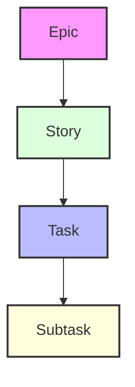

# Cursor 敏捷工作流文档

本文档提供了与 Cursor 的 AI 功能集成的敏捷工作流系统的全面文档。该工作流旨在通过结构化的开发方法来维持项目重点和记忆，并确保一致的进展。

## 概述

敏捷-Cursor 工作流将传统的敏捷方法与 AI 辅助开发相结合，创建了一个强大、高效的开发流程。它可以通过两种主要方式使用：

1. **基于规则的实现**（自动）

   - 使用 `.cursor/rules/workflows/workflow-agile-manual` 和 `.cursor/templates`
   - 自动将标准应用于匹配的文件
   - 提供一致的结构执行

## 工作项层级



1. **Epic（史诗）**

   - 大型、独立的功能
   - 一次只能有一个处于活动状态
   - 示例："在线匹配系统"

2. **Story（故事）**

   - 较小的、可实施的工作单元
   - 必须属于一个 Epic
   - 示例："用户档案创建"

3. **Task（任务）**

   - 技术实现步骤
   - 明确的完成标准
   - 示例："实现数据库模式"

4. **Subtask（子任务）**
   - 细粒度的工作项
   - 通常包括测试要求
   - 示例："编写单元测试"

## AI 项目计划和记忆结构工作流将产生的结果

```
.ai/
├── prd.md                 # 产品需求文档
├── arch.md               # 架构决策记录
├── epic-1/              # 当前 Epic 目录
│   ├── story-1.story.md  # Epic 1 的故事文件
│   ├── story-2.story.md
│   └── story-3.story.md
├── epic-2/              # 未来 Epic 目录
│   └── ...
└── epic-3/              # 未来 Epic 目录
    └── ...
```

## 工作流阶段

### 1. 初始规划

- 专注于文档和规划
- 仅修改 `.ai/`、docs、readme 和规则
- 需要 PRD 和架构的批准

### 2. 开发阶段

- 生成第一个或下一个故事并等待批准
- 实施已批准的进行中的故事
- 按任务执行故事
- 持续测试和验证

```mermaid
graph LR
    subgraph PLAN Phase
        A[Project Idea] --> B[PRD Creation]
        B --> C[Architecture Design]
        C --> D[Epic Planning]
        D --> E[Story Definition]
    end

    subgraph ACT Phase
        E --> F[Story Implementation]
        F --> G[Testing & Validation]
        G --> H[Story Completion]
    end

    subgraph Iteration
        H --> |Next Story|E
        H --> |Epic Complete|I[Epic Completion]
        I --> |Next Epic|D
        I --> |Project Complete|J[Release]
    end

    style A fill:#f9f,stroke:#333,stroke-width:2px
    style B fill:#dfd,stroke:#333,stroke-width:2px
    style C fill:#dfd,stroke:#333,stroke-width:2px
    style D fill:#f9f,stroke:#333,stroke-width:2px
    style E fill:#bbf,stroke:#333,stroke-width:2px
    style F fill:#bbf,stroke:#333,stroke-width:2px
    style G fill:#bbf,stroke:#333,stroke-width:2px
    style H fill:#bbf,stroke:#333,stroke-width:2px
    style I fill:#f9f,stroke:#333,stroke-width:2px
    style J fill:#f9f,stroke:#333,stroke-width:2px
```



## 实施指南

### 故事实施流程

1. **初始化**

   - 验证 `.ai` 目录是否存在
   - 定位已批准的架构和当前故事
   - 确保故事被正确标记为进行中

2. **开发流程**

   - 遵循测试驱动开发（TDD）
   - 定期更新任务/子任务状态
   - 记录所有实施说明
   - 记录使用的重要命令

3. **完成要求**
   - 所有测试必须通过
   - 文档必须更新
   - 用户必须批准完成

### 关键规则

> 🚨 **关键规则：**
>
> - 没有 PRD 和架构批准，永远不要创建第一个故事
> - 一次只能有一个 Epic 处于进行中状态
> - 一次只能有一个 Story 处于进行中状态
> - 故事必须按 PRD 指定的顺序实施
> - 没有用户对故事的批准（在故事文件中标记为进行中），永远不要开始实施

## 使用工作流

在 cursor 0.47.x+ 版本之后，最好的方式是使用基于规则的方法，可以选择手动、代理选择或始终开启的规则。我更喜欢为工作流使用手动选择类型的规则，这样如果我不需要它，它就不会出现在上下文中（后续会解释）。

如果我要开始一个全新的项目（有或没有现有的代码模板），我有几个选择：

- 使用外部工具生成 PRD（如 ChatGPT Canvas 或 o3 mini Web UI 或 Google AI Studio）
- 使用 cursor 中的工作流和代理生成 PRD
  （这取决于个人偏好和对 cursor 中 token 消耗的考虑）

如果我在 cursor 中这样做，我将使用 Claude 3.7 Thinking（或如果担心信用消耗，可以选择不同的模型）开始一个新的代理聊天，并输入类似这样的内容：

`让我们按照 @workflow-agile-manual 为我想创建的新项目创建 PRD，该项目将实现 XYZ，具有以下功能等。让我们首先专注于 MVP 功能，即最小化交付 X，但也要计划一些快速跟进或未来增强的史诗，如 A、B 和 C。`

由于这可能相当长，我经常会在 xnotes 文件夹中编写这个提示，然后将其粘贴到聊天中，确保 @workflow 仍然正确添加。

注意：你也可以修改 workflow-agile-manual 使其成为代理自动可选择的，这也很好用 - 你只需要确保在 front matter 中给出的描述能确保它在需要时被使用（PRD 故事和工作实施阶段）- 或者可能只是将其设为始终规则。在开始时，将其设为始终规则是可以的，直到你的项目增长到非常大的规模，然后我建议手动关闭它，因为那时你可能只是在进行非常有针对性的更新到特定文件或功能 - 不需要整个工作流作为开销 - 或者你可能想要选择不同的工作流（可能是重构工作流、测试工作流、外部 MCP 代理等）

代理应该在 .ai 文件夹中生成一个 prd.md 文件草稿。

我建议在这一点上，不要立即批准并开始 - 要么在 cursor 中使用代理，要么使用外部工具 - 与代理进一步互动以完善文档，让代理询问它可能想知道答案的文档中的漏洞，询问代理是否需要任何澄清，以便初级代理开发人员能够理解和实施故事，询问代理故事的排序是否有意义等...

一旦你觉得它处于一个良好的状态 - 你可以将文件标记为 status: approved。

在这一点上，我会开始另一个聊天并使用工作流 - 代理将首先检查 prd，如果它已获批准，将提供创建（如果尚未存在和批准）架构文件 - 同样，带有工作流的新聊天窗口将搜索新的第一个或进行中的故事。

一旦故事处于进行中状态并获得用户批准 - 可以告诉代理执行故事。一旦故事或部分故事完成，并且代理更新了故事文件的进度，经常提交（我使用我的手动 gitpush.mdc 手动规则宏）。之后，我可能会启动一个新的聊天窗口，使用新的上下文并再次加载工作流。一旦故事完成（status: complete）并经过测试和推送，我总是会启动一个新的带有工作流的聊天窗口，并要求代理"创建下一个故事草稿" - 或者只是问它认为下一步应该做什么，它应该能够从 prd 中识别出下一个要做的故事以及最后一个标记为完成的故事，并为下一个故事生成草稿，然后停止并在我进行任何进一步编码之前请求我的批准。

更详细的示例、最新的仓库和视频即将推出，但这应该给出了主要想法...

注意：一些模型（Sonnet 3.7 thinking）变得有点过于激进，所以可能需要调整规则以进一步确保代理在故事获得批准之前不会开始更新代码。

## 最佳实践

1. **文档和提示**

   - AI 将保持 PRD 和架构文档的更新 - 有时你需要告诉它根据需要更新 prd 和 arch 文件
   - 记录所有重要决策
   - 保持清晰的实施说明
   - 让 AI 在每个 src 子文件夹中创建 readme.md 文件，以帮助指导方向

2. **测试**

   - 让 AI 在实施之前编写测试 - 这是 TDD 的一个有趣的练习
   - 保持高测试覆盖率
   - 在完成之前验证所有测试通过

3. **进度跟踪**

   - 让 AI（或你）定期更新故事状态
   - 记录所有实施说明
   - 记录命令历史

4. **上下文管理**
   - 每个故事或记录重大进度后（记录在任务完成更新中）启动新的 composer 实例
   - 使用适当的上下文级别
   - 最小化上下文开销
   - 考虑在故事执行模式下创建一个更精简的工作流 - 不需要所有关于如何创建 prd 和架构的模板和开销。但你需要考虑它可能需要参考哪些其他文件或文件的部分来保持情节。这就是为什么目前我仍然使用完整的工作流。

## 状态进展

故事遵循严格的状态进展：

```
草稿 -> 进行中 -> 完成
```

Epic 遵循类似的进展：

```
未来 -> 当前 -> 完成
```

## 与 Cursor AI 的集成

工作流设计为与 Cursor 的 AI 功能无缝协作：

1. **AI 辅助规划**

   - AI 帮助创建和完善 PRD
   - AI 建议架构改进
   - AI 协助故事分解

2. **AI 辅助实施**

   - AI 实施故事任务
   - AI 维护测试覆盖率
   - AI 更新文档

3. **AI 辅助审查**
   - AI 验证完成标准
   - AI 建议改进
   - AI 保持一致性

## 成本节约

- 如果你有可用的 Cursor 之外的 LLM，如 ChatGPT、Claude、Gemini 等，它们也很适合生成初始 PRD 和架构，并真正迭代它们。
- 在 Cursor 中，目前你可以使用例如 DeepSeek R1，它似乎是免费的，而且在更新 PRD 和架构方面也不错 - 但我发现它比使用 Claude 来遵循我想要的格式不太可靠 - 但如果试图在 cursor 规划中完成所有工作，成本要低得多。
