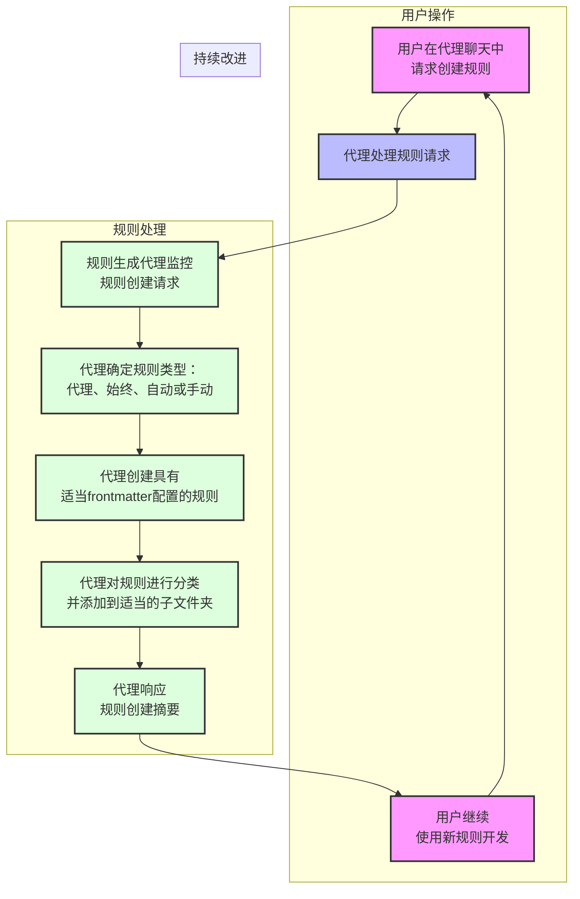

# BMad 的自动规则生成规则（自定义代理迁移到 BMAD-Method）

2025 年 4 月 25 日

本仓库将保留用于规则生成规则 - 但与自定义代理和工作流相关的内容将合并到 https://github.com/bmadcode/BMAD-METHOD - 我在那里的内容对特定工具（Cursor vs Roo vs Cline vs CoPilot）更加通用，而且代理的定义和使用也比这里提出的更好！我将在 5 月 1 日更新仓库以反映这一变化，并建议今后关注 BMAD-METRHOD 仓库。

2025 年 4 月 19 日

Cursor 0.49 版本的更新终于对规则进行了重大改进！修复了一些急需的 bug。

新的[视频](https://youtu.be/1wQUio9TiIQ?si=3KT5NiO5mDL8GR5P)和[仓库](https://github.com/bmadcode/BMAD-METHOD)已经上线，展示了如何将自定义代理与规则结合使用。如果你想尝试将其他工具与 Cursor 结合使用，这个方案更加通用。

2025 年 4 月 16 日

现在你可以直接在对话中使用 `/Generate Cursor Rules` 命令生成规则。这使得定义代理行为变得容易，无需离开聊天界面。

BMad 版本：3.1（2025 年 3 月 30 日）
Cursor 版本：0.48+

BMad 的说明：这个仓库的成功程度超出了我最初的设想，我要感谢大家的反馈、支持、贡献，以及对 YouTube 频道的反馈。我现在意识到，许多人正在使用我最初认为只是记录一些 Cursor 规则最佳实践和帮助生成规则的简单规则的东西 - 所有这些都旨在创建一个单独的更新工作流仓库和文档集。但这已经发展起来了。

考虑到这一点，在这次修正更新之后 - 任何重大更改都将遵循版本标准，当出现可能破坏性的重大更改时，将提供升级路径或迁移说明（如果你已经在使用规则或工作流的早期版本）- 尽管我会尽量避免这种情况，具体取决于 Cursor 更新或工作流改进带来的变化。请记住，大多数更改都是为了跟上不断发展的 Cursor IDE 和功能发布 - 所以会有持续的变化。同样考虑到这一点，要知道长期目标是以不太容易因 Cursor 的变化而需要更改或不稳定的方式构建和工作。这就是为什么例如下面概述的工作流现在正在向更优秀的自定义代理模式发展。

仓库的名称已更改为 BMad Cursor Master Workflow Agent and Rules - 这仍然是关于规则最佳实践的不断发展的项目，但随着 Cursor 的发展，它在功能和能力方面不断发展和扩展，变得越来越强大，以满足 Cursor 和 AI 开发社区的需求，因为这可能最终会扩展到 Cursor 之外。

请查看 [CHANGELOG](./CHANGELOG.md) 了解重要更新和使用公告。

## 重要更新 TL;DR（2025 年 3 月 25 日）

> 💡 **强烈建议的 IDE 设置：** 为了获得最佳的规则生成效果，请更新你的 VS Code 设置（通过右上角按钮以 JSON 格式打开）：
>
> ```json
> "workbench.editorAssociations": {
>   "*.mdc": "default"
> }
> ```

这可以防止 .mdc 文件在自定义规则表单中出现 UI 渲染问题，确保正确的保存功能，并使查看实际规则更容易（特别是关于隐藏的 FrontMatter）。

## 概述

如果你想观看[视频演示和演练](https://youtu.be/jEhvwYkI-og)，请从这里开始，也请订阅更多即将推出的 Cursor 教程！

这个模板通过提供以下功能，显著改进了代理和自定义模式下的 AI 工作流：

1. **自动规则生成：** 通过自然语言请求为所有 4 种主要支持的规则类型创建和更新规则，正确遵循所需的 Cursor 约定
2. **自动自定义代理生成：** 通过向 AI 描述来创建和更新新的自定义代理，AI 将在 .cursor/modes.json 中添加或更新条目
3. **一致的 AI 行为：** 根据创建/存在的 4 种规则类型，规则会在适当时自动应用、按需应用或始终应用
4. **快速项目设置：** 一个脚本，将以非破坏性的方式为新项目设置核心规则和工作流，或将规则生成器添加到现有项目中
5. **自定义代理工作流说明：** 即将推出新指南和新视频，介绍如何遵循大规模可扩展和成功的代理敏捷工作流，使用多个专业化的自定义代理，这比由大规模工作流和广泛规则驱动的任何完整单一代理（以前的工作方式）更安全可靠
6. **自定义代理示例：** 本仓库包含一个在 modes.json 文件中定义的普通自定义代理集，运行 apply-rules 脚本时会复制这些代理，并且在 samples 文件夹中还有一些更有趣的基于角色个性的选项，这些选项用于说明（虽然在与代理一起工作时也可以同样成功和有趣地使用）- 这些不会自动复制到新项目文件夹中

> 💡 **注意：** 有关不使用自定义代理的敏捷-Cursor 工作流系统的完整指南（不再推荐），请参阅[敏捷工作流文档](docs/agile-readme.md)。

## 关于 Cursor 规则的关键概念

- 规则使用带有适当 YAML 格式的 frontmatter（description、globs、alwaysApply）
- 通过明确请求创建规则或通过要求代理进行纠正行为来生成规则
- 通过包含有效和无效示例来增强规则，以更好地训练 llm
- 简短、重点突出的规则（目标：25 行，最大：50 行）
- 在自动组织的子文件夹分类结构中的四种规则类型
- 规则将在 .cursor/rules/子文件夹下的适当位置生成 - 但请记住，无论是否有子文件夹 - cursor 规则必须在 .cursor/rules 或其子文件夹中，并且必须具有 .mdc 扩展名

## 快速开始选项

### A) npm cli

#### 🛠 要求

- Node.js >= 22.14.0

#### 📥 安装和使用

```bash
npx cursor-rules-deploy /path/to/your/project
```

更多使用示例，请参考 [cursor-rules-deploy](https://github.com/rosendolu/cursor-rules-deploy#readme)

### B) 新项目设置

使用敏捷工作流和规则生成器启动新项目：

```bash
# 克隆此仓库
git clone https://github.com/bmadcode/cursor-auto-rules-agile-workflow.git
cd cursor-auto-rules-agile-workflow

# 使用规则创建新项目
./apply-rules.sh /path/to/your/project

# 示例：
./apply-rules.sh ~/projects/my-project
```

该脚本创建你的项目文件夹（如果需要），包含所有规则、文档和配置文件，以开始使用敏捷工作流。

### C) 添加到现有项目

使用规则生成器增强你当前的项目：

```bash
# 克隆此仓库
git clone https://github.com/bmadcode/cursor-auto-rules-agile-workflow.git
cd cursor-auto-rules-agile-workflow

# 将规则应用到你的项目
./apply-rules.sh /path/to/your/project
```

该脚本将：

1. 将模板规则复制到你项目的 `.cursor/rules/` 目录
2. 添加工作流文档
3. 保留任何现有规则

## 规则生成的工作原理



## 规则生成提示示例

无需明确说"创建规则" - 只需描述所需的行为：

- "创建一个平衡全面性和简洁性的 TypeScript 文件注释标准"
- "请创建一个代理规则，以便每当我特别请求对某个主题进行深入研究时，你都会首先将系统日期时间注入上下文，并使用 Tavily 搜索 MCP 工具来改进结果。"
- "永远不要再创建 JS 文件，你只能创建 TS 或 JSON 文件！"或"我让你为我们的项目设置 Jest，你创建了一个 JestConfig.js 文件，但这是一个仅 TypeScript 的项目。永远不要再创建任何 JS 文件。始终使用 TypeScript 或在必要时使用 JSON。" - 这个请求的第二个版本将确保规则示例包含这个具体的提醒，帮助代理从实际错误中更好地学习。
- "确保所有 TypeScript 文件中的错误处理正确"
- "在通信中像海盗一样说话，但在代码或文档中不要这样"
- "更新测试标准以要求 80% 的覆盖率"
- "在代码中强制执行一致的命名约定"
- "标准化文档格式"
- "在 TypeScript 文件中按字母顺序组织导入组"

AI 自动：

1. 创建/更新规则文件
2. 将其放在正确的位置
3. 遵循格式标准
4. 维护版本控制

## 规则类型

| 规则类型      | 用法                        | description 字段 | globs 字段     | alwaysApply 字段 |
| ------------- | --------------------------- | ---------------- | -------------- | ---------------- |
| 代理选择      | 代理查看描述并选择何时应用  | 关键             | 空白           | false            |
| 始终          | 应用于每个聊天和 cmd-k 请求 | 空白             | 空白           | true             |
| 自动选择      | 应用于匹配的现有文件        | 空白             | 关键 glob 模式 | false            |
| 自动选择+描述 | 更适合新文件                | 包含             | 关键 glob 模式 | false            |
| 手动          | 用户必须在聊天中引用        | 空白             | 空白           | false            |

## 私有规则、MCP 配置和自定义代理

如果你想要有仓库中其他人不使用的规则 - 你可以在用户文件夹的 .cursor/rules 文件夹中添加规则。它们也将应用于你打开的每个项目，这是一个潜在的好处。此外，你可以使用带有自己规则的自定义代理，这些规则不会共享。将来当 Cursor 添加 agents.json 文件（或类似名称）的功能时 - 那么你应该仍然能够将其添加到用户文件夹的 .cursor 文件夹中。这也适用于 mcp.json。

## 自定义代理生成

自定义代理允许比使用 cursor 规则文件更直接地限定和指导代理可以做什么和不能做什么。使用自定义代理，你可以指定代理可以使用的工具（包括 cursor 原生和 mcp），更重要的是，你可以控制它使用的模型并给它一个自定义提示来指导它的操作方式。这就像为你创建的这种特定类型的代理直接注入一个清晰的始终规则。当与敏捷工作流结合使用时，你可以拥有专门的项目经理代理、架构师代理、设计师和 UX 专家代理、前端、后端和特定语言专家开发人员，并让它们都专注于它们擅长的领域，为它们提供真正的护栏。

Cursor 在即将推出的更新中将允许在 JSON 文件中创建和维护这些 - 在此之前，这些必须在一个有点不稳定且文本输入区域很小的 GUI 中一个一个地手动创建。

所以我想出了一种文件格式来存储我的自定义代理的所有信息 - 虽然目前不被 cursor 使用，但它是一种在文本编辑器中配置所有选项并定义其自定义提示的简单方法 - 然后通过 GUI 输入或更新。

你可以在示例中看到 star-trek-agents.md 文件 - 这是我用 chatGPT 创建和头脑风暴的各种角色或代理的有趣主题版本。然后我使用模板和自定义规则将该文件转换为 modes.json。对于示例，我将该输出保存为 samples 文件夹中的 star-trek-agents-modes.json。.cursor 下的 modes.json 文件是一种更实用的方法，可以创建一些与敏捷工作流方法配合良好的代理。

将来，该 modes.json 文件将被 cursor 的官方文件格式取代，届时本仓库将使用新的约定进行更新。

## 最佳实践

### 规则创建

- 让 AI 处理规则创建和更新 - 但如果你发现有过多或冗余的内容，不要害怕修剪规则以帮助它们达到核心实用性和本质
- 明确说明所需的行为
- 提供好/坏模式的示例
- 对于新项目，允许规则自然出现，并尝试总体上减少规则，更多地依赖自定义代理的自定义指令
- 如果你开始对同一概念有许多非常小的规则 - 例如你看到你的 typescript 规则子文件夹有许多文件 - 你可以要求代理将它们合并和压缩到一个文件中，如果它们都普遍适用并同时被代理获取

### AI 行为控制

- 在注意到不一致的行为时创建规则
- 使用清晰、描述性的语言
- 通过审查规则验证 AI 的理解

### 工作流集成

- 从模板规则开始
- 让 AI 随着项目的发展而发展规则
- 使用 AI 进行规则管理以保持一致性

### 规则删除

- 随着代码库的增长，一些规则变得不必要，因为 AI 将遵循周围的代码风格和约定
- 规则越少越好 - 所以随着代码库的变化或模型的改进而修剪规则
- 你今天需要的规则，明天可能不需要，然后你可能在另一天又需要它 - 试错和进化是处理我们正在处理的非确定性性质的关键

## 从索引中排除的文件

`.cursorindexingignore` 功能允许某些文件可访问但从索引中排除：

- 模板移动到 `.cursor/templates` 文件夹
- 包含在 `.cursorindexingignore` 中但不在 `.cursorignore` 中
- XNotes 保留在 `.cursorignore` 中（需要移动到其他地方才能使用的文件）

> 💡 **兼容性：** 已在 Claude Sonnet 3.5、3.7、3.7 Thinking、o3-mini 和 GPT-4o 上测试。
> [敏捷工作流文档](docs/agile-readme.md)

## 贡献

欢迎贡献以改进基础规则或建议新模板。请遵循既定标准。

## 许可证

MIT 🚀
